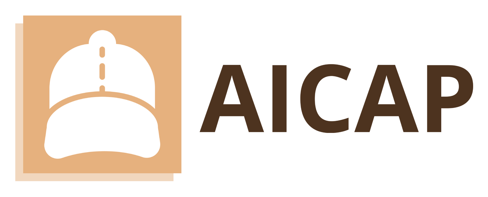

# AICAP

## Description
The Artificial Intelligence Codeforces Analytics Platform (AICAP) is a comprehensive tool designed for competitive programmers and coding enthusiasts. AICAP offers deep insights into Codeforces user activity, providing detailed analytics to enhance performance and foster continuous improvement. This platform stands at the intersection of data analysis, machine learning, and coding challenges, making it an invaluable resource for programmers aiming to excel in the competitive coding sphere.

## Key Features:

1. **Activity Insights:** AICAP visualizes user activity on Codeforces, offering in-depth charts and graphs that track the number of problems solved, contest participation, and rating changes over time.

2. **Personalized Recommendations:** AICAP's intelligent recommendation system suggests problems tailored to each user's skill level and areas of improvement, helping users tackle challenges that align with their current proficiency and learning goals.

3. **Rating Predictor:** AICAP predicts the time required for users to achieve their desired Codeforces rating. Leveraging historical contest data and machine learning algorithms, this feature provides a roadmap for users to set realistic goals and monitor their progress effectively.

4. **Rating Distribution Analysis:** Explore the distribution of user ratings across Codeforces. AICAP's visualizations offer insights into the competitive programming community, enabling users to understand the competitive landscape and set benchmarks for their own progress.

With AICAP, competitive programmers can strategize, practice efficiently, and stay motivated on their coding journey. Whether you're a beginner aiming to advance your skills or a seasoned coder aspiring to reach new heights, AICAP is your trusted companion for data-driven, effective learning in the world of competitive programming. Start your journey with AICAP today and elevate your coding game to the next level.
